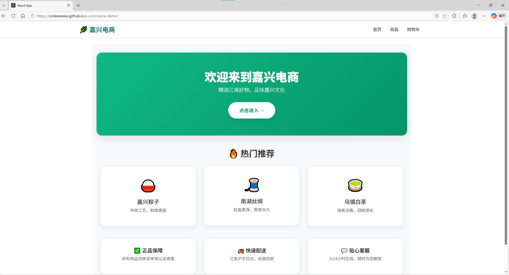
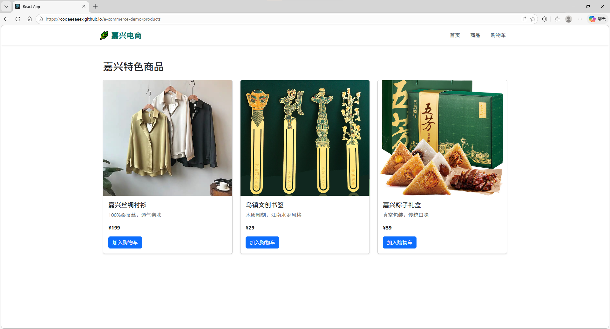
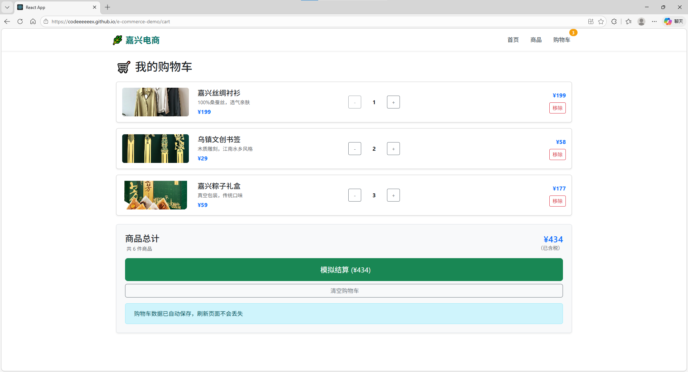

# 🛍️ 嘉兴电商Demo - React项目

一个完整的电商前端项目，展示React核心功能 + Bootstrap响应式设计。

## ✨ 功能特性

- ✅ 响应式商品列表展示
- ✅ 购物车功能
- ✅ 商品数量调整（+/- 按钮）
- ✅ 本地存储（刷新页面不丢失）
- ✅ 烟雨江南主题设计
- ✅ 响应式导航菜单（手机端汉堡菜单）
- ✅ 模拟结算流程

## 🖥️ 技术栈

- **前端框架**: React 18
- **状态管理**: React Hooks (useState, useEffect)
- **UI库**: Bootstrap 5
- **路由**: React Router DOM
- **数据持久化**: LocalStorage API
- **图标**: Bootstrap Icons
- **部署**: GitHub Pages
- **版本控制**: Git

## 🚀 在线演示

👉 [点击体验电商Demo](https://codeeeeeex.github.io/e-commerce-demo)

## 📸 截图预览

| 首页                                | 商品页                                    | 购物车                                |
| ----------------------------------- | ----------------------------------------- | ------------------------------------- |
|  |  |  |

## 📁 项目结构

```
e-commerce-demo/
├── public/
│   ├── index.html
│   └── favicon.ico
│   ├── images
├── screenshots
├── src/
│   ├── components/         # 可复用组件
│   │   ├── Header.jsx     # 导航栏
│   │   └── ProductCard.jsx # 商品卡片
│   ├── data/              # 数据
│   │   └── products.js    # 商品数据
│   ├── pages/             # 页面组件
│   │   ├── Home.jsx      # 首页
│   │   └── Home.css      # 首页样式
│   │   ├── Products.jsx  # 商品列表页
│   │   └── Cart.jsx      # 购物车页
│   ├── App.js            # 主组件
│   ├── App.css           # 全局样式
│   └── index.js          # 入口文件
├── README.md             # 项目说明
└── package.json          # 项目配置
```

## 🔧 本地运行

```bash
# 1. 克隆项目
git clone https://github.com/codeeeeeex/e-commerce-demo.git

# 2. 进入目录
cd e-commerce-demo

# 3. 安装依赖
npm install

# 4. 启动开发服务器
npm start
```

## 🎯 核心功能实现

### 购物车数量调整

```jsx
// 用 useState 管理购物车状态
const [cart, setCart] = useState(() => {
  const saved = localStorage.getItem("cart");
  return saved ? JSON.parse(saved) : [];
});

// 商品数量调整
const updateQuantity = (id, newQuantity) => {
  setCart((prevCart) => {
    if (newQuantity <= 0) {
      return prevCart.filter((item) => item.id !== id);
    }
    return prevCart.map((item) =>
      item.id === id ? { ...item, quantity: newQuantity } : item,
    );
  });
};
```

### 响应式导航菜单

```jsx
// 用 React 状态控制菜单展开/收起
const [isMenuOpen, setIsMenuOpen] = useState(false);
const toggleMenu = () => setIsMenuOpen(!isMenuOpen);

// 动态类名控制显示
<div className={`collapse navbar-collapse ${isMenuOpen ? 'show' : ''}`}>
```

## 📈 学习收获

通过本项目，我深入掌握了：

- React组件化开发思想
- 状态管理和数据流控制
- 响应式布局设计
- 前端工程化部署流程
- 从原型到上线的完整项目流程
